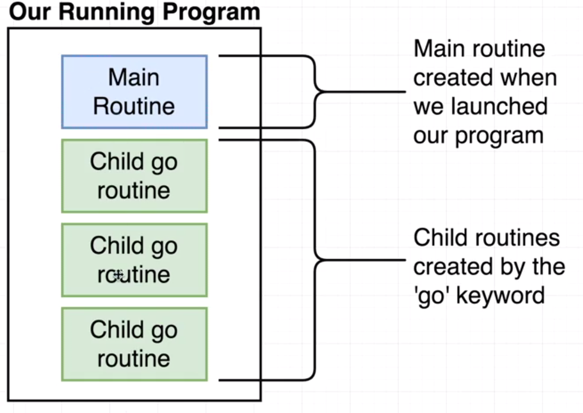

## Goroutines

Goroutines are functions that are created and scheduled to be run independently by the Go scheduler. The Go scheduler is responsible for the management and execution of goroutines.

## Notes

* Goroutines are functions that are scheduled to run independently.
* We must always maintain an account of running goroutines and shutdown cleanly.
* Concurrency is not parallelism.
	* Concurrency is about dealing with lots of things at once.
	* Parallelism is about doing lots of things at once.


```text
f() // A normal function call that executes f synchronously and waits for completing it
go f() // A goroutine that executes f asynchronously and doesn't wait for completing it
```

