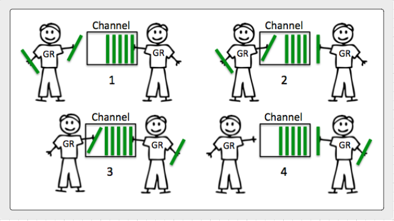

## Channels
Channels allow goroutines to communicate with each other
 through the use of signaling semantics.
  Channels accomplish this signaling through the use of
   sending/receiving data or by identifying state changes 
   on individual channels. 
   
   Don't architect software with
    the idea of channels being a queue, focus on signaling
     and the semantics that simplify the orchestration required.
     
 #### Buffered and Unbuffered channels
 Go provides a mechanism called a channel that is used to share data between goroutines. There are two
 types of channels based on their behavior: unbuffered channels and buffered channels. An unbuffered
 channel is used to perform synchronous communication between goroutines; a buffered channel is used for
 perform asynchronous communication.
 
 A channel is created by the make function, which specifies the chan keyword and a channel’s element type.
 
 ##### Unbuffered channel
 Here is the code block that creates an unbuffered channel:
 ```text

// Unbuffered channel of integer type
counter := make(chan int)
```
An unbuffered channel of integer type is created using the built-in function make . The channel counter
can act as a conduit for values of integer type. You can use both built-in types and user-defined types as the
type of channel element.
 ##### Buffered channel
 A buffered channel is created by specifying its capacity. Here is the code block that declares a buffered
  channel
```

// Buffered channel of integer type buffering up to 3 values
nums := make(chan int,3)

```
 

A buffered channel of integer type is created with capacity of 3. The channel nums is capable of
buffering up to three elements of integer values.

 
 
 ##### Buffered Communication
 
 
 ##### UnBuffered Communication
 
 
 ###  Communication with Channels
 
 A channel has three operations: send , receive , and close . A send operation sends a value or a pointer into
 a channel, and the value or pointer reads from the channel when a corresponding receive operation is
 executed. The communication operator <- is used for both send and receive operations:
 
 ```text
counter <- 10
```

The preceding statement shows a send operation that sends a value to the channel named counter .
When you write a value or pointer into a channel, the operator <- is put on the right side of the channel
variable.

```text
num = <- counter
```
The preceding statement shows a receive operation that receives a value from a channel named
counter . When you receive a value or pointer from a channel, the operator <- is put on the left side of the
channel variable.

A channel has a close operation that closes the channel so that a send operation on the channel cannot
take place. 

A send operation on a closed channel will result in a panic . A receive operation on a closed
channel returns the values that have already been sent into the channel before it closed; after that, a receive
statement returns the zero value of the channel’s element type.