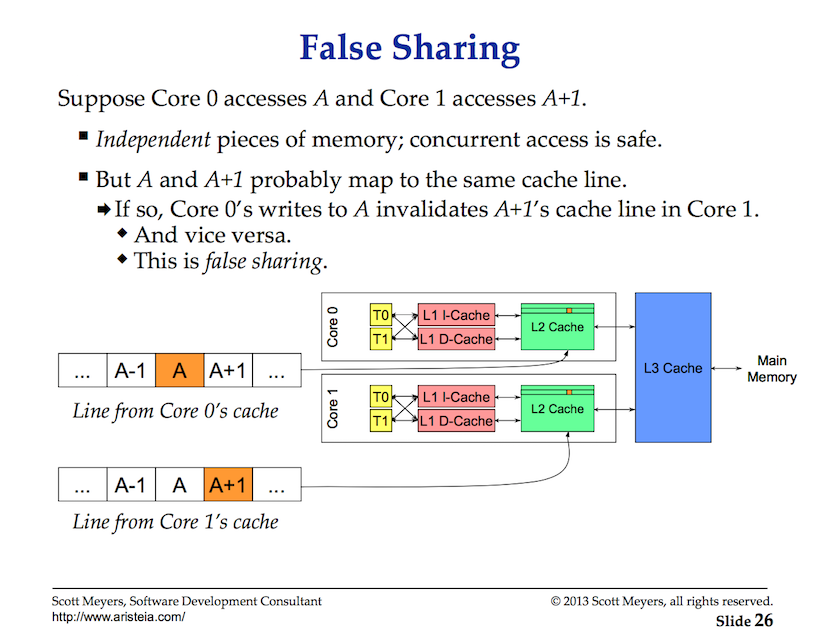

## Data Races

A data race is when two or more goroutines attempt to read and write to the same resource at the same time. Race conditions can create bugs that appear totally random or can never surface as they corrupt data. Atomic functions and mutexes are a way to synchronize the access of shared resources between goroutines.

We have race conditions primarily when more than one thread tries to access a shared resource (memory,cache,file etc.)
and atleast one of them is a writer.

## Notes

* Goroutines need to be coordinated and synchronized.
* When two or more goroutines attempt to access the same resource, we have a data race.
* Atomic functions and mutexes can provide the support we need.

## Cache Coherency and False Sharing
This slide is provided by Scott Meyers :

[CPU Caches and Why You Care (30:09-38:30)](https://youtu.be/WDIkqP4JbkE?t=1809)  

All in all the summary is if a thread from one core tries to change value
in one cache the cache is invalidated(marked dirty) across all other cores 
to maintain synchronization.

This of course causes the main performance hit for using threads.

#### Program Demo
In the program demonstrating race conditions, two go routines try
to increment a counter value

### Eliminating Race Conditions

There are two ways to avoid race conditions one is to se mutexes and the other
is to use atomic instructions.

Also if we eliminate false sharing we can scale our code linearly.