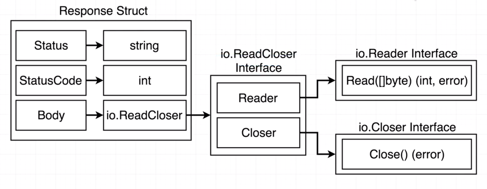

### HTTP interfaces

The idea here is to implement read and write interface for 
creating  a GET request to get the web page of any website.

Reader interface is to read contents from http web page and writer to
write contents to stdout